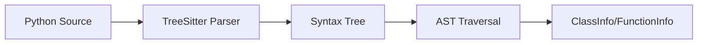

# Parser Module

The parser module provides TreeSitter-based Python parsing for accurate code analysis.

## Usage

```python
from pygrad import RepoTreeSitter

# Parse a repository
parser = RepoTreeSitter("./my-repo")
parser.parse()

# Access parsed data
for file_info in parser.files:
    print(f"File: {file_info.path}")
    print(f"  Classes: {len(file_info.classes)}")
    print(f"  Functions: {len(file_info.functions)}")
```

---

## Classes

### RepoTreeSitter

```python
class RepoTreeSitter:
    def __init__(self, repository_path: str) -> None
```

TreeSitter-based parser for Python repositories.

Uses the tree-sitter library with tree-sitter-python grammar for accurate,
syntax-aware parsing of Python source code.

**Parameters:**

| Name | Type | Description |
|------|------|-------------|
| `repository_path` | `str` | Path to the repository root |

**Features:**

- Accurate syntax parsing (not regex-based)
- Handles complex Python syntax correctly
- Extracts docstrings from AST
- Preserves source location information

#### Methods

##### parse

```python
def parse(self) -> None
```

Parse all Python files in the repository.

**Example:**

```python
from pygrad import RepoTreeSitter

parser = RepoTreeSitter("./my-repo")
parser.parse()
```

##### parse_file

```python
def parse_file(self, file_path: str) -> FileInfo
```

Parse a single Python file.

**Parameters:**

| Name | Type | Description |
|------|------|-------------|
| `file_path` | `str` | Path to the Python file |

**Returns:** `FileInfo` - Parsed file information

**Example:**

```python
from pygrad import RepoTreeSitter

parser = RepoTreeSitter("./my-repo")
file_info = parser.parse_file("./my-repo/src/main.py")

print(f"Module: {file_info.module_name}")
for cls in file_info.classes:
    print(f"  Class: {cls.name}")
```

---

## TreeSitter Integration

pygrad uses TreeSitter for parsing because it provides:

1. **Accuracy**: Parses the actual Python grammar, not approximations
2. **Speed**: Incremental parsing for large codebases
3. **Robustness**: Handles syntax errors gracefully
4. **Completeness**: Access to full AST information

### How It Works



### Extracted Information

For each Python file, the parser extracts:

| Element | Information |
|---------|-------------|
| **Classes** | Name, docstring, bases, methods, decorators |
| **Functions** | Name, docstring, parameters, return type, decorators |
| **Methods** | Same as functions, plus class association |
| **Imports** | Module imports (for dependency analysis) |

---

## Advanced Usage

### Direct TreeSitter Access

For advanced use cases, you can access the underlying TreeSitter tree:

```python
from pygrad.parser.treesitter import RepoTreeSitter
import tree_sitter_python as tspython
from tree_sitter import Language, Parser

# Create parser with Python language
PY_LANGUAGE = Language(tspython.language())
parser = Parser(PY_LANGUAGE)

# Parse source code
source = b'''
def hello(name: str) -> str:
    """Say hello."""
    return f"Hello, {name}!"
'''

tree = parser.parse(source)
root = tree.root_node

# Traverse the tree
def traverse(node, depth=0):
    print("  " * depth + f"{node.type}: {node.text[:50] if node.text else ''}")
    for child in node.children:
        traverse(child, depth + 1)

traverse(root)
```

### Custom Node Extraction

```python
from pygrad.parser.treesitter import RepoTreeSitter

parser = RepoTreeSitter("./my-repo")
parser.parse()

# Find all type annotations
def find_type_annotations(node):
    annotations = []
    if node.type == "type":
        annotations.append(node.text.decode())
    for child in node.children:
        annotations.extend(find_type_annotations(child))
    return annotations

# Process parsed files
for file_info in parser.files:
    # Access the raw tree for custom analysis
    pass
```

---

## Supported Python Features

The parser handles all modern Python syntax:

| Feature | Support |
|---------|---------|
| Classes | Full support including dataclasses |
| Functions | Regular, async, generator |
| Type hints | Parameters and return types |
| Decorators | Single and stacked |
| Docstrings | Google, NumPy, Sphinx styles |
| f-strings | Fully supported |
| Match statements | Python 3.10+ |
| Walrus operator | Python 3.8+ |

---

## Dependencies

The parser module requires:

```toml
[project.dependencies]
tree-sitter = ">=0.21.0"
tree-sitter-python = ">=0.21.0"
```

These are automatically installed with pygrad.
