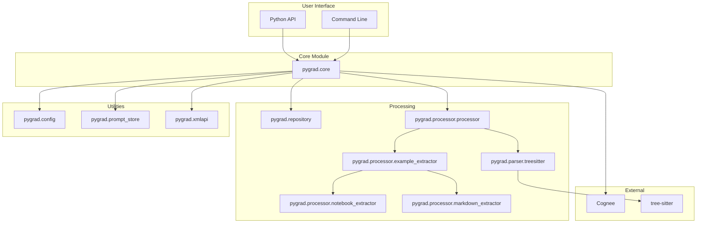

# Components

Detailed description of Pygrad's internal components.

## Component Overview



---

## pygrad.core

**Purpose**: Main API module providing numpy-style functions.

### Functions

| Function | Description |
|----------|-------------|
| `add(url)` | Index a repository |
| `search(url, query)` | Search documentation |
| `list()` | List indexed datasets |
| `delete(url)` | Remove a repository |
| `visualize(path)` | Export graph as HTML |
| `get_dataset(name)` | Get dataset by name |

### Internal Functions

| Function | Description |
|----------|-------------|
| `_create_xml_api_doc(url)` | Generate XML documentation |
| `_split_xml_api(path)` | Split XML into documents |
| `_cognee_add_xml_api(path, name)` | Index in Cognee |

---

## pygrad.repository

**Purpose**: Repository cloning and identification utilities.

### Functions

```python
def get_repository_id(url: str) -> str:
    """Extract unique repository ID from GitHub URL.
    
    Args:
        url: GitHub repository URL
        
    Returns:
        Repository ID in format "owner-repo" (lowercase)
        
    Example:
        >>> get_repository_id("https://github.com/Pydantic/Pydantic")
        "pydantic-pydantic"
    """
```

```python
def clone_repository(url: str, path: str | Path) -> None:
    """Clone a Git repository to the specified path.
    
    Uses shallow clone (--depth 1) for speed.
    
    Args:
        url: Git repository URL
        path: Local destination path
        
    Raises:
        RuntimeError: If cloning fails
    """
```

---

## pygrad.parser.treesitter

**Purpose**: Python source code AST parsing using tree-sitter.

### RepoTreeSitter

```python
class RepoTreeSitter:
    """Extract Python source code structure for LLM processing."""
    
    def __init__(self, scripts_path: str):
        """Initialize with path to Python scripts."""
    
    def extract_structure(self, filename: str) -> dict:
        """Extract structure from a Python file.
        
        Returns:
            {
                "structure": [
                    {
                        "type": "class",
                        "name": "Calculator",
                        "docstring": "...",
                        "methods": [...]
                    },
                    {
                        "type": "function",
                        "details": {...}
                    }
                ],
                "imports": {...}
            }
        """
    
    def analyze_directory(self, path: str) -> dict:
        """Analyze all Python files in directory.
        
        Returns:
            Dictionary mapping filenames to their structures
        """
```

### Extracted Information

For each **class**:
- Name, docstring, decorators
- Attributes, methods
- Start line number

For each **method/function**:
- Name, arguments, return type
- Docstring, decorators
- Source code, start line

---

## pygrad.processor.processor

**Purpose**: Process repositories and generate API documentation.

### PythonRepositoryProcessor

```python
class PythonRepositoryProcessor:
    """Processes Python repositories to generate LLM-ready API documentation."""
    
    def process_repository_data(self) -> tuple[list[ClassInfo], list[FunctionInfo]]:
        """Process repository and return structured data."""
    
    def save_repository_data(
        self,
        classes: list[ClassInfo],
        functions: list[FunctionInfo],
        important_files: list[tuple[str, float]],
        output_file: str = "api.xml"
    ) -> str:
        """Save processed data to XML file."""
```

### Data Classes

```python
@dataclass
class FunctionInfo:
    name: str
    api_path: str           # e.g., "mypackage.Calculator.add"
    description: str        # Docstring content
    header: str             # e.g., "def add(self, x: int) -> int"
    output: str             # Return type
    usage_examples: list[str]

@dataclass
class ClassInfo:
    name: str
    api_path: str
    description: str
    initialization: dict[str, str]  # {"parameters": "...", "description": "..."}
    methods: list[FunctionInfo]
    usage_examples: list[str]
```

---

## pygrad.processor.example_extractor

**Purpose**: Extract usage examples from test and example directories.

### ExampleExtractor

```python
class ExampleExtractor:
    """Extracts method-level usage examples from test and example codebases."""
    
    def extract_examples(
        self,
        project_structure: dict,
        test_paths: list[str],
        example_paths: list[str]
    ) -> dict[str, APIUsageGroup]:
        """Extract usage examples from test and example directories."""
```

### Data Classes

```python
@dataclass
class UsageExample:
    source_file: str        # File where example was found
    function_name: str      # Test function name
    source_code: str        # Full source code
    start_line: int
    used_api_elements: set[str]
    example_type: str       # "test" or "example"
    docstring: str | None
    header: str | None
    variable_name: str | None

@dataclass
class APIUsageGroup:
    api_path: str           # API element this demonstrates
    examples: list[UsageExample]
    total_usage_count: int
```

---

## pygrad.processor.notebook_extractor

**Purpose**: Extract examples from Jupyter notebooks.

### NotebookExampleExtractor

Parses `.ipynb` files to find code cells that demonstrate API usage.

---

## pygrad.processor.markdown_extractor

**Purpose**: Extract code examples from Markdown documentation.

### MarkdownExampleExtractor

Parses `.md` files to find Python code blocks and link them to API elements.

---

## pygrad.xmlapi

**Purpose**: XML entity extraction for knowledge graph indexing.

### Functions

```python
def extract_entities(xml_api_path: Path) -> tuple[
    list[str],  # classes
    list[str],  # methods
    list[str],  # functions
    list[str]   # examples
]:
    """Extract top-level entities from API XML documentation.
    
    Returns formatted strings suitable for knowledge graph indexing.
    """
```

---

## pygrad.config

**Purpose**: Configuration constants and utilities.

### Constants

```python
PYGRAD_HOME = Path.home() / ".pygrad"
REPO_STORAGE = PYGRAD_HOME / "repos"
```

### Functions

```python
def ensure_storage_exists() -> Path:
    """Ensure the repository storage directory exists."""
```

---

## pygrad.prompt_store

**Purpose**: Load and manage prompt templates.

### PromptStore

```python
class PromptStore:
    """Store for loading prompt templates."""
    
    def load(self, relative_path: str) -> str:
        """Load a prompt file by relative path.
        
        Args:
            relative_path: Path relative to prompts directory
            
        Returns:
            Contents of the prompt file
        """
```

### Built-in Prompts

- `grad.md`: System prompt for documentation queries

---

## External Dependencies

### Cognee

Pygrad uses [Cognee](https://github.com/topoteretes/cognee) for:

- Vector storage and similarity search
- Knowledge graph construction
- LLM-powered entity extraction
- Graph-based context extension

### Tree-sitter

[Tree-sitter](https://tree-sitter.github.io/tree-sitter/) provides:

- Fast, incremental parsing
- Accurate Python AST analysis
- Cross-platform compatibility

## Next Steps

- [Configuration](../configuration/index.md) - Set up LLM and database
- [API Reference](../api/index.md) - Complete function documentation
