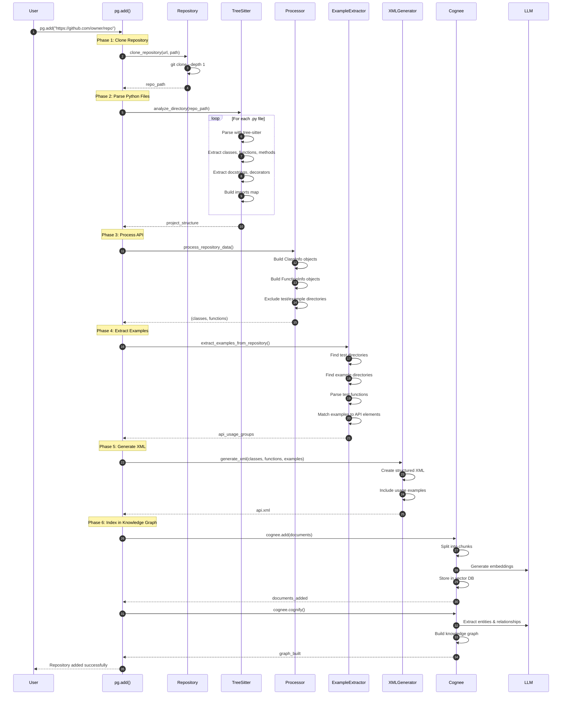
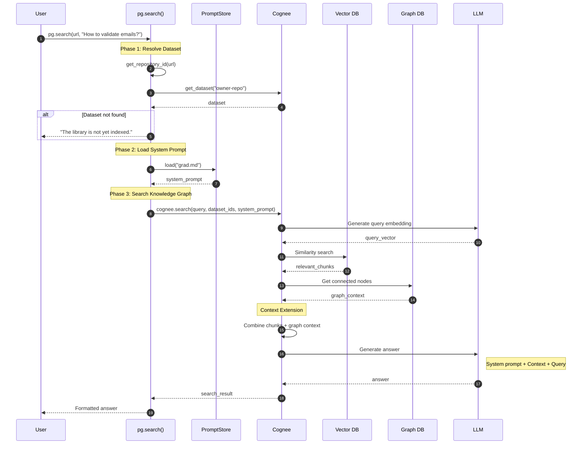
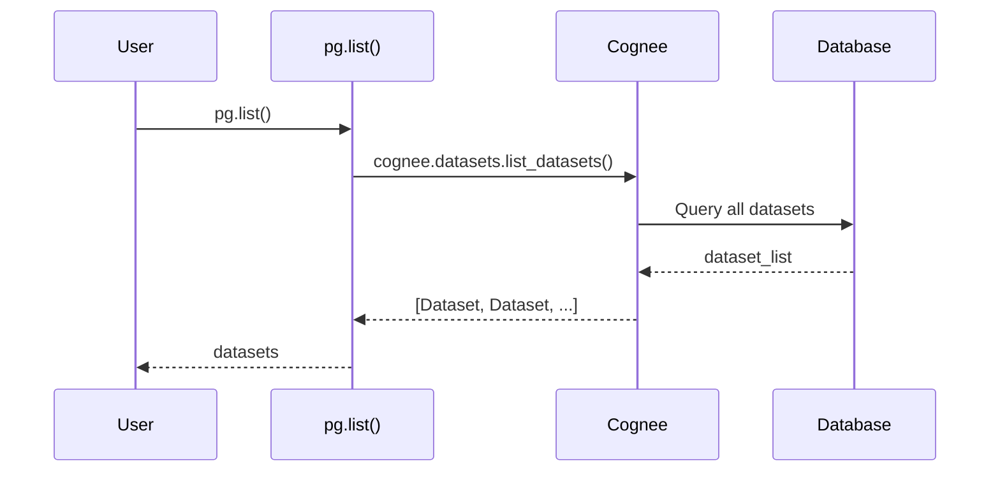
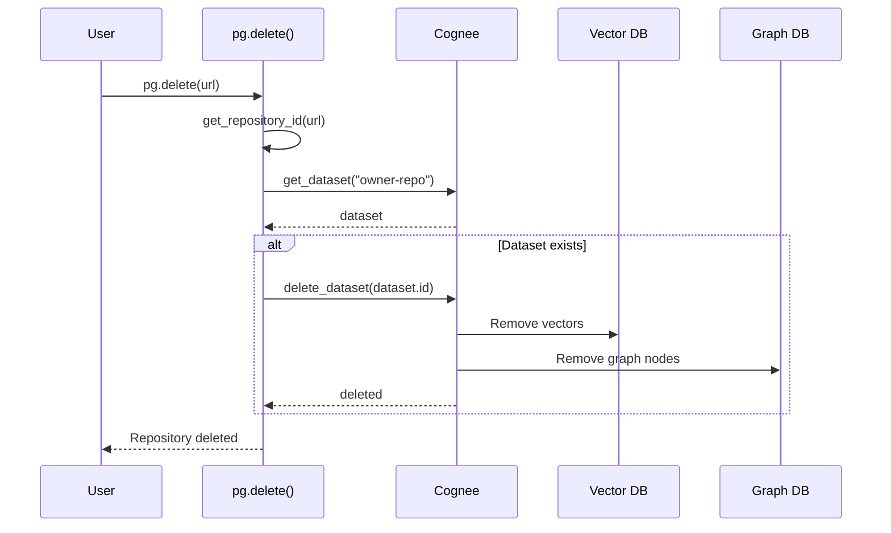
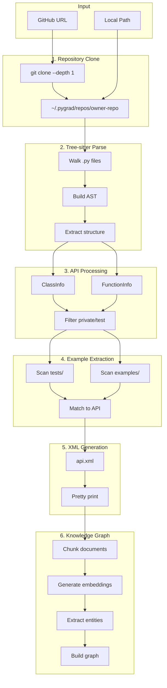

# How It Works

Detailed technical explanation of Pygrad's processing and search flows.

## Adding a Repository (`pg.add()`)

When you call `pg.add(url)`, the following sequence occurs:



### Phase Details

#### Phase 1: Clone Repository

```python
# Shallow clone for speed
git clone --depth 1 https://github.com/owner/repo /path/to/repo
```

- Uses `--depth 1` for faster cloning
- Stores in `~/.pygrad/repos/{owner}-{repo}`

#### Phase 2: Parse Python Files

Tree-sitter parses each Python file and extracts:

- **Classes**: Name, docstring, decorators, attributes
- **Methods**: Name, arguments, return type, docstring
- **Functions**: Name, arguments, return type, docstring
- **Imports**: Module paths, aliases

#### Phase 3: Process API

The processor creates structured data objects:

```python
ClassInfo(
    name="Calculator",
    api_path="mypackage.Calculator",
    description="A simple calculator class.",
    initialization={"parameters": "self, initial_value: int = 0", ...},
    methods=[FunctionInfo(...), ...],
    usage_examples=[...]
)
```

#### Phase 4: Extract Examples

The example extractor finds real usage:

- Scans `tests/`, `test/` directories
- Scans `examples/`, `example/` directories
- Parses test functions starting with `test_`
- Links examples to API elements they use

#### Phase 5: Generate XML

Structured XML documentation:

```xml
<repository>
  <important_files>
    <file score="100">core.py</file>
  </important_files>
  <class>
    <name>Calculator</name>
    <api_path>mypackage.Calculator</api_path>
    <methods>...</methods>
    <usage_examples>...</usage_examples>
  </class>
</repository>
```

#### Phase 6: Index in Knowledge Graph

Cognee processes the documentation:

1. **Chunking**: Splits XML into semantic chunks
2. **Embedding**: Generates vector embeddings
3. **Entity Extraction**: Identifies classes, methods, relationships
4. **Graph Building**: Creates connected knowledge graph

---

## Searching Documentation (`pg.search()`)

When you call `pg.search(url, query)`:



### Search Phases

#### Phase 1: Resolve Dataset

```python
repo_id = get_repository_id("https://github.com/owner/repo")
# Returns: "owner-repo"

dataset = await get_dataset(repo_id)
# Returns: Dataset object or None
```

#### Phase 2: Load System Prompt

The system prompt instructs the LLM how to answer:

```markdown
You are the definitive technical documentation expert for this library.
Adopt a clear, instructional tone focused on helping developers...
```

#### Phase 3: Search Knowledge Graph

1. **Query Embedding**: Convert question to vector
2. **Similarity Search**: Find relevant documentation chunks
3. **Graph Context**: Expand with related entities (classes methods reference)
4. **LLM Generation**: Generate comprehensive answer

---

## Listing Repositories (`pg.list()`)



---

## Deleting a Repository (`pg.delete()`)



---

## Processing Pipeline Detail



## Next Steps

- [Components](components.md) - Detailed component descriptions
- [Configuration](../configuration/index.md) - LLM and database setup
- [API Reference](../api/index.md) - Function signatures and parameters
