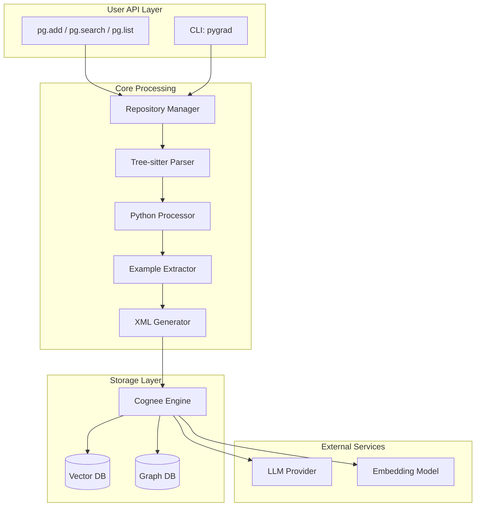

# Architecture

Understand Pygrad's internal architecture and design.

## Overview

Pygrad is built on a modular architecture that separates concerns into distinct components:



## Key Concepts

### Graph RAG

Pygrad uses **Graph RAG** (Retrieval-Augmented Generation with Graph context):

1. **Knowledge Graph**: API documentation is stored as a connected graph of entities (classes, methods, functions, examples)
2. **Semantic Search**: Queries are matched against the graph using vector embeddings
3. **Context Extension**: Related nodes in the graph are included to provide richer context
4. **LLM Generation**: An LLM generates the final answer using the retrieved context

### Data Flow

```
GitHub URL → Clone → Parse → Extract → XML → Graph → Search → Answer
```

## Learn More

<div class="grid" markdown>

<div class="card" markdown>

### [:material-cog: How It Works](how-it-works.md)

Detailed sequence diagrams showing the complete data flow.

</div>

<div class="card" markdown>

### [:material-puzzle: Components](components.md)

Description of each component and its responsibilities.

</div>

</div>
